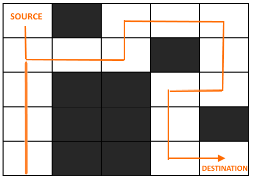
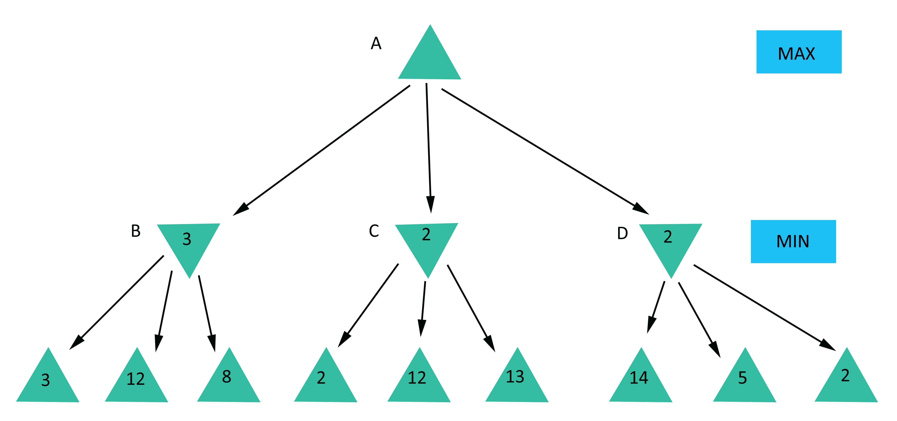

# Search - CS50AI Lecture 0

## Terms:

#### Agent:
Entity that perceives its environment and acts upon that environment.

#### State:
A configuration of the agent and its environment.
  
#### Initial state:
The beginning state of the agent.

#### Actions:
Choices that can be made in a state.
ACTIONS(`s`) returns the set of actions that can be executed in state `s`.

#### Transition model:
A description of what state results from performing any applicable action in any state.
RESULT(`s`, `a`) returns the state resulting from performing action `a` in state `s`.

#### Goal Test:
Way to determine whether a given state is a goal state.

#### Path Cost:
Numerical cost associated with a given path.

#### State Space:
The set of all states reachable from the initial state by any sequence of actions.

#### Solution:
A sequence of actions that leads from the initial state to a goal state.

#### Optimal Solution:
A solution that has the lowest path cost among all possible solutions.

#### Node:
A data structure that keeps track of:

- a **state**
- a **parent** (node that generated this node)
- an **action** (action applied to parent to get node)
- a **path cost** (from initial state to node)

#### Frontier:
A data structure that stores all available options (nodes) to explore.

#### Stack:
LIFO (Last-In, First-Out) data type.

#### Queue:
FIFO (first-in, first-out) data type.

## Solving Search Problems:

There are multiple different algorithms and techniques that can be applied to solve search problems. 
Some of them have been briefly described below.

### Depth First Search:

Depth First Search implements its frontier using the Stack data structure. Due to this, it always expands 
the deepest node in the frontier. If that path leads to a dead-end, it traverses back to the decision point and continues 
searching. It will always find a solution but it won't always be the shortest.

DFS algorithm going through a maze from start to finish:  


### Breadth First Search:

Breadth First Search is an algorithm that always expands the shallowest nodes in the frontier first. This algorithm uses
a queue as the frontier and explores all neighbor nodes at the current depth before moving on to the next level. BFS always finds a solution and it's the shortest solution.

BFS algorithm going through a maze from start to finish:  


### Uninformed Search:

A searching technique that uses no knowledge specific to the problem: DFS and BFS.

### Informed Search:

A search technique that uses knowledge specific to the problem to find more optimal solutions.

#### Greedy Best-First Search:

A search algorithm that expands the node closest to the goal. We can determine what is closer to the goal by using a heuristic function _h(n)_. In the maze example, the heuristic function could use the distance formula between any two cells to figure out which one is closer to the goal.

#### A* Search:

A search algorithm that expands node with the lowest value of `g(n) + h(n)`

`g(n)` = cost to reach node  
`h(n)` = estimated cost to goal

Optimal If:

- `h(n)` is admissible (never overestimates the true cost)
- `h(n)` is consistent (for every node **n** and successor **n'** with step cost `c`, `h(n) ≤ h(n')` + `c`)

This ultimately means that heuristic value for a node `n` should be less than the heuristic value of node `n'`, its successor.

## Adversarial Search:

A kind of search where the computer is not the sole participant(maze solving). Adversarial search is a type of search
where an agent is playing against one or more agents.

### Minimax

A search algorithm that provides an optimal move for an agent by trying to minimize/maximize a possible loss/gain.

In the case of a tic-tac-toe game:

- MAX player (X) aims to maximize score.
- MIN player (O) aims to minimize score.

The Game:

- S<sub>0</sub>: initial state
- PLAYER(s): returns which player to move in state **_s_**
- ACTIONS(s): returns legal moves in state **_s_**
- RESULT(s, a): returns state after action **_a_** taken in state **_s_**
- TERMINAL(s): checks if state **_s_** is a terminal state
- UTILITY(s): final numerical value for terminal state

Pseudocode:

- **MAX** picks action **_a_** in **ACTIONS(_s_)** that produces highest value of **MIN-VALUE(RESULT(_s_, _a_))**

- **MIN** picks action **_a_** in **ACTIONS(_s_)** that produces smallest value of **MAX-VALUE(RESULT(_s_, _a_))**

```
function MAX-VALUE(state):
  if TERMINAL(state):
    return UTILITY(state)
  v = -∞
  for action in ACTIONS(state):
    v = MAX(v, MIN-VALUE(RESULT(state, action)))
  return v

function MIN-VALUE(state):
  if TERMINAL(state):
    return UTILITY(state)
  v = ∞
  for action in ACTIONS(state):
    v = MIN(v, MAX-VALUE(RESULT(state, action)))
  return v
```

Visualization of this algorithm:


## Optimizations:

### Alpha-Beta Pruning:

An optimization technique for the minimax algorithm that prunes branches in a tree to reduce computation and increase efficiency.

### Depth-Limited Minimax:

In our case, minimax will work for a game like tictactoe where the total number of game states is fairly low(255,168). However, just minimax on its own would be of no match against a game like chess where the total number of game states is very high(10<sup>29000</sup>).

Rather than consider every move, Depth-Limited Minimax stops after a certain point an uses an evaluation function that estimates the expected utility of the game from a given state.