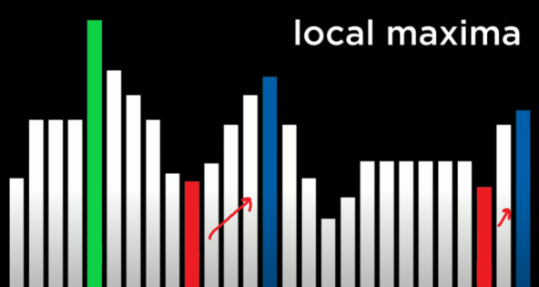
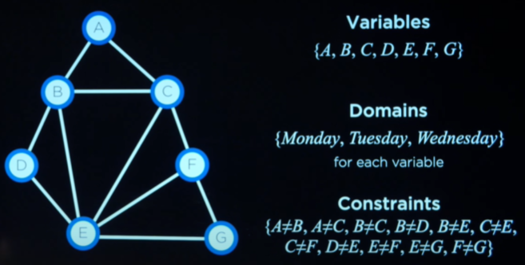
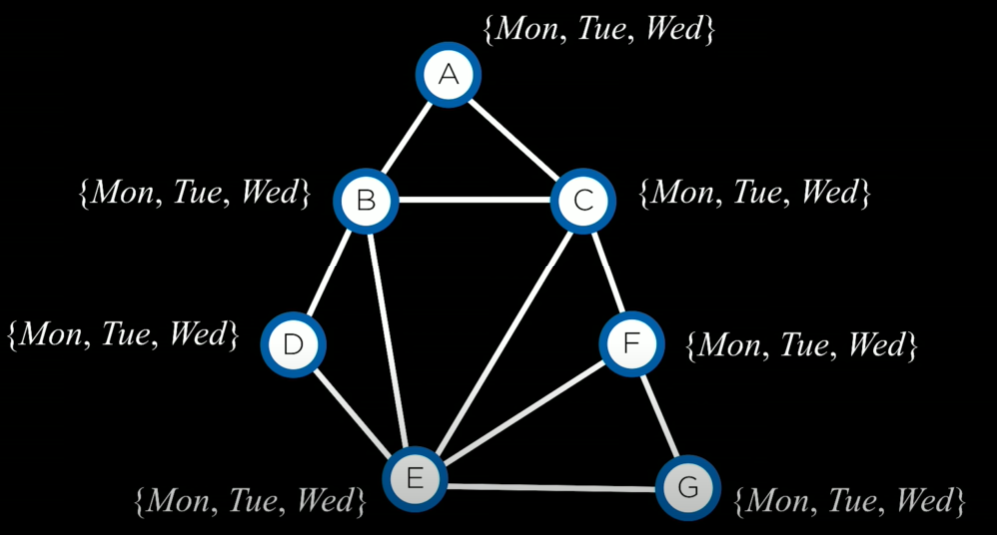
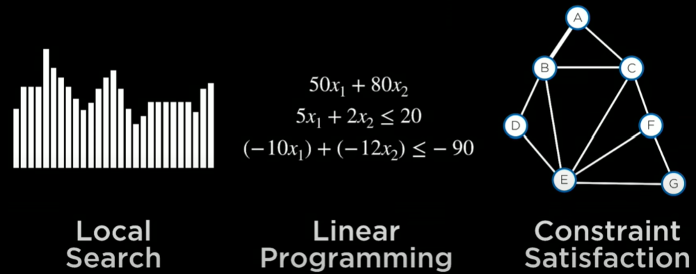

# Optimization - CS50AI Lecture 3

Choosing the best option from a set of options

## Local Search:

Search Algorithms that maintain a **single** node and searches by moving to a neighboring node. This differs from algorithms like BFS and DFS as they maintain multiple nodes in the frontier. Let's imagine an example where given 4 houses, you have to place 2 hospitals such that the distances from the houses to the hospitals are minimized.


## State-Space Landscape:

We can think of the above example from a more abstract perspective using state-space landscapes. Each bar represents a particular configuration of hospitals and the height of each bar generally represents some function of that state. In this case, it could represent the path cost.


### Objective Function:

The function we are trying to optimize while finding the **global maximum** from a number of states.

### Cost Function:

The function we are trying to optimize while finding the **global minimum** from a number of states. In the case of houses and hospitals, this function would be used for distance.

## Hill Climbing:

### Find Max:
Starts at a given state. If left state is higher, goes left. If right state is higher, goes right. If both are less, terminates.

### Find Min:
Starts at a given state. If left state is lower, goes left. If right state is lower, goes right. If both are higher, terminates.

### Pseudocode:

```python
function Hill-Climb(problem):
    current = initial state of a problem
    repeat:
        neighbor = highest valued neighbor of current
        # If none are better, then return
        if neighbor better than current:
            return current
        # Go to higher value
        else:
            current = neighbor
```

### Hill Climbing Limitations:

It doesn't always find the global maximum/minimum  


### Hill Climbing Variants:

| Variant           | Definition                                    |
|-------------------|-----------------------------------------------|
| Steepest-Ascent   | Choose the highest valued neighbor            |
| Stochastic        | Choose randomly from highest valued neighbors |
| First Choice      | Choose the first highest valued neighbor      |
| Random-restart    | Conduct Hill Climbing multiple times          |
| Local Beam Search | Chooses the _k_ highest-valued neighbors      |

Even with these variants, hill climbing poses the problem that we'll never reliably be able to find the global maxima or minima. Hill climbing never decides to go to a worse state and ultimately, we will need to do that in order to find the **best** case(example of why above).

## Simulated Annealing:

- Early on, higher "temperature": more likely to accept neighbors that are worse than current state.
- Later on, lower "temperature": less likely to accept neighbors that are worse than current state.

```python
function Simulated-Annealing(problem, max):
    current = initial state of problem
    for t = 1 to max:
        # calculated temperature based on time, in this case, t (How far into the process we are).
        T = temperature(t)
        neighbor = random neighbor of current
        ΔE = how much better neighbor is than current
        if ΔE > 0:
            current = neighbor
        # In some cases, we want to choose a worse neighbor and this is based on two things, the temperature and
        # how much worse the neighboring state is compared to the current: T and ΔE.
        With probability e^(ΔE/T), set current = neighbor
```

This allows us to dislodge ourselves and explore spaces which will ultimately have the best values.

## Linear Programming:

- Minimize a cost function 
- With constraints of from  or of form

- With bounds for each variable 

### Linear Programming Application Problem:

- Two machines `X1` and `X2`. `X1` costs $50/hour to run, `X2` costs $80/hour to run. Goal is to minimize cost.
- `X1` requires 5 units of labor per hour. `X2` requires 2 units of labor per hour. Total of 20 units of labor to spend.
- `X1` produces 10 units of output per hour. `X2` produces 12 units of output per hour. Company needs at least 90 units of output.

- **Cost Function:** 
- **Constraint:** 
- **Constraint:**  or 
+(-12x_2)%20\leq%20-90)

## Constraint Satisfaction:

### Terms:

**Hard Constraints:** Constraints that must be satisfied in a correct solution.  
**Soft Constraints:** Constraints that express some notion of which solutions are preferred over others.  
**Unary Constraints:** Constraint involving only one variable(_A_ ≠ _Monday_).  
**Binary Constraints:** Constraint involving two variables(_A_ ≠ _B_).

### Algorithm:

- Set of variables 
- Set of domains for each variable 
- Set of constraints 

An example of constraint satisfaction could be the problem of exam scheduling where you have a list of students, classes and exam days and we will need to figure out on what days to schedule exams for classes so that no student is taking two exams on the same day. Given students, classes, and exam days:

`Students:` {1, 2, 3, 4}  
`Classes:` {_A_, _B_, _C_, _D_, _E_, _F_, _G_}  
`Exam Days:` {_Monday_, _Tuesday_, _Wednesday_}

Such that:

| Student | List of Classes |
|---------|-----------------|
|    1    |  _A_, _B_, _C_  |
|    2    |  _B_, _D_, _E_  |
|    3    |  _C_, _E_, _F_  |
|    4    |  _E_, _F_, _G_  |

We can come up with a constraint graph that models precisely this. A connection between nodes _A_ and _B_ signifies they cannot be on the same day. Nodes _B_ and _F_, for example, can be on the same day because there is no connection between them(no student is taking both _B_ and _F_).



## Node Consistency: 

**Definition:** When all the values in the variable's domain satisfy the variable's unary constraints.

Let's say students _A_ and _B_ can take on a domain of variables:


Constraints: {_A_ ≠ _Mon_, _B_ ≠ _Tue_, _B_ ≠ _Mon_, _A_ ≠ _B_}

For _A_ to be node-consistent, we have to remove _Mon_ from _A_'s domain and then, the new domain({_Tue_, _Wed_}), satisfies _A_'s unary constraints. Now for _B_, we would similarly have to remove _Tue_ and _Mon_ from _B_'s domain so that it becomes node-consistent. Now, we've considered all the unary constraints but we have yet to consider the binary ones.

## Arc Consistency:

**Definition:** When all the values in the variable's domain satisfy the variable's binary constraints.   
**Concept:** For _X_ to be arc-consistent with respect to _Y_, remove elements from _X_'s domain until every choice for _X_ has a possible choice for _Y_.

After making _A_ and _B_ node-consistent, we ended with these values:

_A_ : {_Tue_, _Wed_}    
_B_ : {_Wed_}

From the logic point of view, _A_ is arc-consistent with _B_ when _B_ has a choice(that is consistent) with all values of _A_. In the above situation, when _A_ takes on the value of _Tue_, _B_ has a choice of _Wed_ that doesn't violate the constraints. However, when _A_ takes on the value of _Wed_, there is no possible choice for _B_ to make that doesn't violate the constraints. If _B_ were to take on _Wed_, it would violate _A_ ≠ _B_. To fix this and make _A_ arc-consistent with _B_, we would have to remove _Wed_ from _A_'s domain. Then, We can conclude that _A_ = _Tue_, _B_ = _Wed_.

### Pseudocode:

**For a single arc:**  
`csp` = constraint satisfaction problem
```python
# Makes X arc-consistent with respect to Y
function Revise(csp, X, Y):
    revised = false
    # Loop through all possible values in X's domain
    for x in X.domain:
        # If no possible value y in Y's domain given x, delete x
        if no y in Y.domain that satisifies constraint for (X, Y)
            delete x from X.domain
            revised = true
    return revised
```

**For entire CSP:**

```python
function AC-3(csp):
    queue = all arcs in csp
    while queue non-empty:
        (X, Y) = DEQUEUE(queue)
        if REVISE(csp, X, Y)
            # If something was revised and X has no values left, the problem is unsolvable
            if size of X.domain == 0:
                return false
            # If there are values in X, we want to make sure they are still arc-consistent after the revision
            for each Z in X.neighbors - {Y}:
                ENQUEUE(queue, (Z, X))
    return true
```

### Limitations:

Given this example:



Arc-consistency considers just two variables so it's quite easy to make all nodes here arc-consistent with their neighbors. This  means `AC-3` won't be able to solve this problem on its own but, we can use search algorithms along with it to do so.

### CSP as Search Problems:

- initial state: empty assignment (no variables)
- actions: add a {_variable_ = _value_} to assignment
- transition model: shows how adding an assignment changes the assignment
- goal test: goal test: check if all variables assigned and constraints all satisfied
- path cost function: all paths have the same cost

## Backtracking Search:

The main idea of backtracking search is to assign variables values and if the `var = value` assignment doesn't lead to any violations of the constraints, we can add it to the assignments. Then, call backtrack recursively on the new assignment to make sure all variables are consistent but if this call fails, that means `var` can't be equal to `value`. We would then remove it from the assignment and then move on to the next value in `var`'s domain.

### Pseudocode:
```python
function BACKTRACK(assignment, csp)
    # If all variables have been assigned values, return assignment
    if assignment complete: 
        return assignment
    var = SELECT-UNASSIGNED-VAR(assignment, csp)
    for value in DOMAIN-VALUES(var, assignment, csp):
        # If the value doesn't cause an issue, add it to assignments as a possible value
        if value consistent with assignment:
            add {var = value} to assignment
            # Call backtrack after the new (var, value) has been added. If there are no problems, return that result
            result = BACKTRACK(assignment, csp)
            if result ≠ failure:
                return result
        # If there was a problem that means var can't take on that value so remove it from assignment
        remove {var = value} from assignment
```

## Inference & Maintaining Arc Consistency:

**Main idea:** When we make a new assignment to _X_, calls _AC-3_ starting with a queue of all arcs(_Y_, _X_) where _Y_ is a neighbor of _X_.

To improve the efficiency of how we solve these problems, we could go back to the idea of inference. In this algorithm, we enforce arc-consistency every time we make a new assignment to make sure we can eliminate values when possible. We can add this into the backtracking algorithm to get:

```python
function BACKTRACK(assignment, csp)
    # If all variables have been assigned values, return assignment
    if assignment complete: 
        return assignment
    var = SELECT-UNASSIGNED-VAR(assignment, csp)
    for value in DOMAIN-VALUES(var, assignment, csp):
        # If the value doesn't cause an issue, add it to assignments as a possible value
        if value consistent with assignment:
            add {var = value} to assignment
            # INFERENCE: New things we can infer along with maintaining arc-consistency
            inferences = INFERENCE(assignment, csp)
            if inferences ≠ failure: add inferences to assignment
            # Call backtrack after the new (var, value) has been added. If there are no problems, return that result
            result = BACKTRACK(assignment, csp)
            if result ≠ failure:
                return result
        # If there was a problem that means var can't take on that value so remove it from assignment along with all inferences
        remove {var = value} and inferences from assignment
    return failure
```

### SELECT-UNASSIGNED-VAR:

- Minimum remaining values (MRV) heuristic: select the variable that has the smallest domain
- Degree heuristic: select the variable that has the highest degree(`var` that has the highest connections).

### DOMAIN-VALUES:

- Least-constraining values heuristic: return variables in order by number of choices that are ruled out for neighboring variables
  - Try least-constraining values first

## Problem Formations:

