# Machine Learning - CS50AI Lecture 4

Machine learning is the study of computer algorithms that improve automatically through experience.

## Supervised Learning:

Given a data set of input-output pairs, learn a function to map inputs to outputs.

## Classification:

Supervised learning task of learning a function mapping an input point to a discrete category. For example, if we wanted to figure out whether it was going to rain tomorrow, based on past experiences/data, the computer should be able to draw reasonable conclusions. We have already taken a look at how to approach similar problems using probability but we won't always have definite probabilities that we use. Machine learning algorithms focus more on the idea of using historical data instead. An example of historical data could be the following:  
[Markdown Table Generator](https://github.com/itsmihirrao/MarkdownTableGenerator)

|Date     |Humidity|Pressure|Rain   |
|---------|--------|--------|-------|
|January 1|93%     |999.7   |Rain   |
|January 2|49%     |1015.5  |No Rain|
|January 3|79%     |1031.1  |No Rain|
|January 4|65%     |984.9   |Rain   |
|January 5|90%     |975.2   |Rain   |

What we would like to do is write a function _f_ that can predict something based on a certain input (_humidity_, _pressure_). 

```
f(humidity, pressure)
```
PREDICT:
```
f(93, 999.7) = Rain
f(49, 1015.5) = No Rain
f(79, 1031.1) = No Rain
```

Since we don't know exactly how _f_ works, we can write a _hypothesis_ function that does the same thing as _f_. _f_ and _h_ can then check each other's values for more reliable results.

### 2D Graphs:

One approach we can use to predict, in our case, `rain` or `no rain` would be to graph the data points. With `humidity` on the _x_ axis and `pressure` on the _y_ axis, we can first graph all the data points where it did rain.

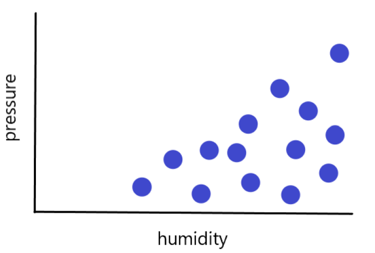

Then, we can do the same for all the data points where it didn't rain.

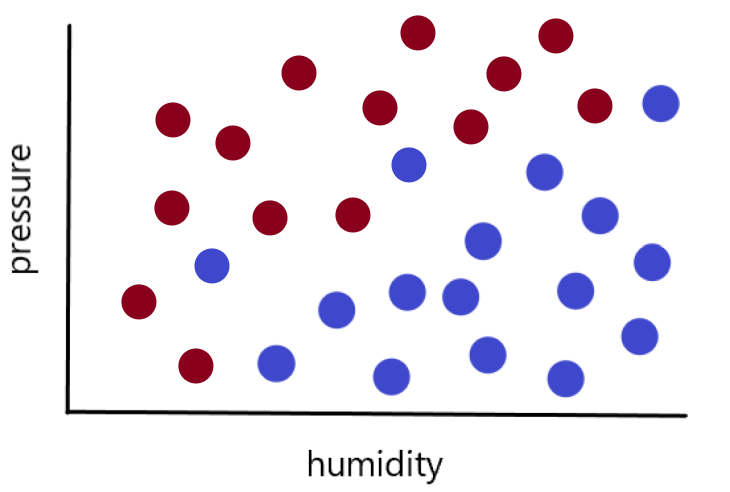

### Nearest-Neighbor Classification:

Algorithm that, given an input, chooses the class of the nearest data point to that input. This algorithm, like most, has its downsides. When outliers exist in a data set, it won't always choose what is most appropriate. In the case below, us humans would probably agree that given the humidity and pressure of the white dot, it will rain. However, the computer will choose the closest data point, in this case, not raining.

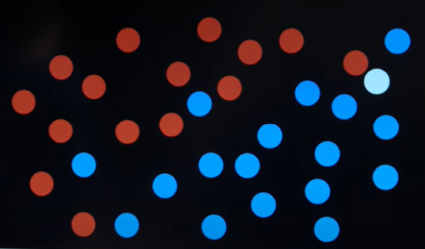

### _k_-Nearest-Neighbor Classification:

Algorithm that, given an input, chooses the most common class out of the _k_ nearest data points to that input. This is a much better approach because it takes into consideration "location" of the data point and doesn't reach conclusions based on just one neighbor. However, this algorithm also has a few downsides:

- It could be slow to go through every neighbor and measure distance(there are optimizations).
  - Data pruning
  - Data structures
  - Select relevant data

## Data Boundaries:

Another way to approach classification is to look at all the data and somehow come up with a decision boundary. In the case of two dimensions, we can draw a line that separates the rainy days from the non-rainy days.

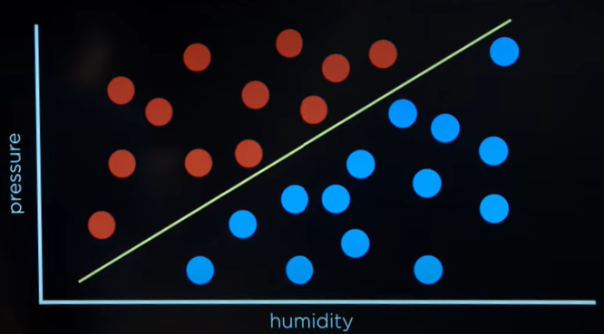

Obviously, data sets will never be this clean. There are usually outliers and other factors that will pollute the data. We still want to be able to draw boundaries but these boundaries may not always be linear.

_x<sub>1</sub>_ = Humidity  
_x<sub>2</sub>_ = Pressure

_h_(_x<sub>1</sub>_, _x<sub>2</sub>_) = 1 if _w<sub>0</sub>_ + _w<sub>1</sub>x<sub>1</sub>_ + _w<sub>2</sub>x<sub>2</sub>_ ≥ 0.
0 _otherwise_

Where:
-  _w_'s are weights that determine the boundary
-  1 : Rain
-  0 : No Rain

The dot product of the following vectors represent the same idea:

Weight Vector: **w**:(_w<sub>0</sub>_, _w<sub>1</sub>_, _w<sub>2</sub>_)  
Input Vector: **x**:(1, _x<sub>1</sub>_, _x<sub>2</sub>_)  
**w** * **x**: _w<sub>0</sub>_ + _w<sub>1</sub>x<sub>1</sub>_ + _w<sub>2</sub>x<sub>2</sub>_

Then, we can later simplify the hypothesis function to look a little something like this:

_h_<sub>**w**</sub>(_X_) = 1 if **w** * **x** ≥ 0. 0 otherwise.

Now, the big question is how to determine the values of the weights. For this, we can use a technique known as perceptron learning rule.

## Perceptron Learning Rule:

Given data point (_**x**_, _**y**_), update each weight according to:
<p align="center">
  
</p>

More generally, this formula states:
<p align="center">
  
</p>

If the actual value was equal to the value we predicted, then the right side of the expression would equal 0 and the weight wouldn't change. If the actual value was greater than our predicted value(_actual - estimate > 0_), we would increase the weight so the value of the dot product goes up. However, if the actual value was lower than the predicted value(_actual - estimate < 0_), we would decrease the weight so the value of the dot product goes down. This is one way we can teach the computer to "learn" and choose the appropriate boundaries.

### Hard & Soft Threshold:

One problem with our function is that it will always choose rain or no rain. In some cases, this may be what we want but if a data point is close to the boundaries, it may not make sense to make such a definite conclusion. Looking at the image below, we see that if the value resulting from the dot product is barely to the right of the vertical line(the threshold), we strongly conclude a value of 1.

**Hard Threshold**:  
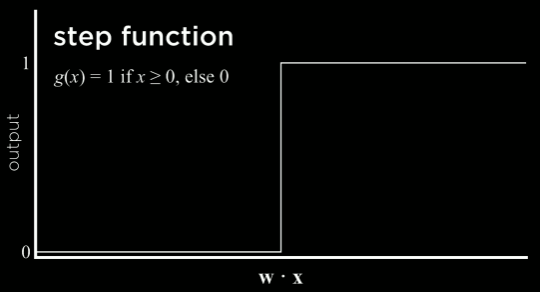

To represent this more logically, we can use soft thresholds instead.

**Soft Threshold**:  
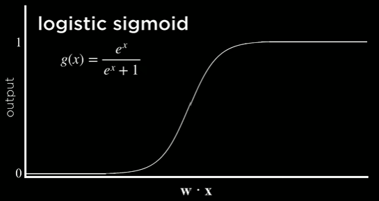

Now, as the output from the dot product gets larger and larger, we can conclude the outcome with more certainty. In other words, the output isn't restricted to either 1 or 0 and this allows to express likeliness and probability.

### Other Classification Functions:

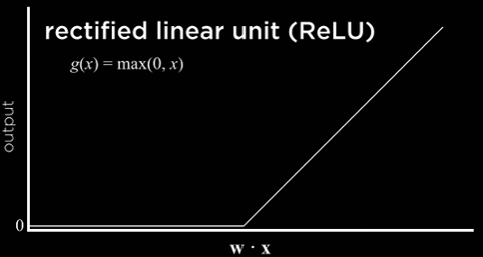

### Summary: 

Given some vector of weights that have been determined by past data, our hypothesis function will determine which class an input belongs to. The problem then, is to find a vector of weights that are representative of our data. At first, we can set the weights to random values and as we run the simulations with the training data, the weights will start to become more and more accurate. Changing the weights will use our hypothesis function which, intern, will use the weights.

- Perceptron can only be used where there is a maximum of 2 classes(ex: rain/no rain)
- Perceptron doesn't care about how close the boundary is to the data(this can lead to lower precision/accuracy).
 
## Support Vector Machines:

### Maximum Margin Separator:

Boundary that maximizes the distance between any of the data points. In some cases, drawing boundaries may be rather arbitrary. For example, there isn't always just 1 way you can draw a line between data points and this ultimately leads to other problems:

- Data points for whom we want to predict the outcome could be really close to both data sets.
- This makes predicting outcomes hard.

To solve this issue, we can draw our line based on the idea of a **maximum margin separator** that will position the boundary as far away from the data points as possible.

Example:

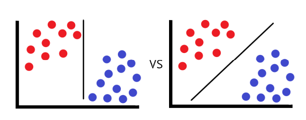

### Regression:

**Supervised learning task of learning a function mapping an input point to a continuous value.** Instead of creating boundaries, we can try to find the line of best fit and use that as a reference to determine the result.

## Loss Functions:

Function that expresses how poorly our hypothesis performs.

### 0-1 Loss Function:

_L_(actual, predicted) = 0 if actual = predicted, 1 otherwise

### L<sub>1</sub> Loss Function:

**_L_(actual, predicted) = |actual - predicted|**. We can use this to find the line of best fit. The less loss, the more accurate our predictions will be.

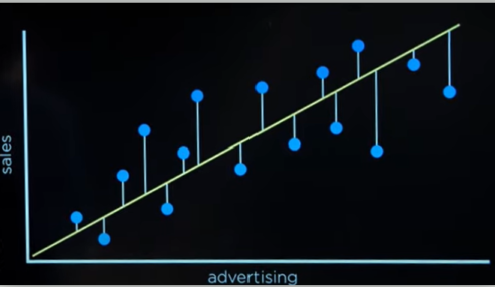

### L<sub>2</sub> Loss Function:

**_L_(actual, predicted) = (actual - predicted)<sup>2</sup>**. This version penalizes outliers more harshly.

## Overfitting:

A model that fits too closely to a particular data set and therefore may fail to generalize to future data.

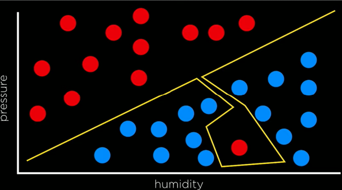

Sometimes, a boundary that has a loss is better than a boundary that has no loss.

## Cost:

With the cost function below, we run into the problem of overfitting.

_cost(h)_ = _loss(h)_

To fix this, we must introduce some other aspect to the cost function so that we don't end up drawing a boundary that exactly matches the data. One thing we can add is _complexity(h)_ that determines how complicated our boundary is. We would rather give precedence to something simpler rather than something complex. The new cost function could be written as follows:

_cost(h)_ = _loss(h)_ + _complexity(h)_

## Regularization:

Penalizing hypotheses that are more complex to favor simpler, more general hypotheses.

In the above equation, we would like to penalize boundaries that are complex more than boundaries that are less complex.

_cost(h)_ = _loss(h)_ + _**λ**complexity(h)_

With this, we can represent the idea that if λ is larger, then we want to penalize that complexity more but if λ is smaller, then we want to penalize the complexity less.

## Holdout Cross-Validation:

Splitting data into a training set and a test set, such that learning happens on the training set and is evaluated on the test set.

## _k_-Fold Cross-Validation:

Splitting data into _k_ sets, and experimenting _k_ times, using each set as a test set once, and using remaining data as training set.

## Reinforcement Learning:

Given a set of rewards or punishments, learn what actions to take in the future.

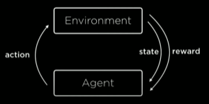

Given that the agent is in some sort of state, the agent has to take an action and in return, will get either a reward or a punishment. It ends up in a new state and repeats the same process. In order to formulate these worlds, we'll use something known as the Markov Decision Process.

### Markov Decision Process:

Model for decision making, representing states, actions, and their rewards. Similar to markov chains where the action-state path is linear, this process has more of a tree-like structure where each state has multiple different possible actions. Also, In a markov chain, the transition between one state to another is purely based on probability. In this case, we will assign rewards/punishments to each possible action and that will be the determining factor of what action the AI chooses.

Main ideas:
- Set of states: _S_
- Set of actions: _ACTIONS(s)_ 
- Transition model: _P_(_s'_ | _s_,_a_)
- Reward function: _R_(_s_, _a_, _s'_)

### Q-Learning

Method for learning a function _Q_(_s_,_a_) estimate of the value(reward) of performing action _a_ in state _s_

- Start with _Q_(_s_, _a_) = 0 for all _s_,_a_
- When we take an action and receive a reward:
  - Estimate the value of _Q_(_s_, _a_) based on current reward and expected future rewards
  - Update _Q_(_s_, _a_) to take into account old estimate as well as our new estimate

Approach:

- Start with _Q_(_s_, _a_) = 0 for all _s_,_a_
- Every time we take an action _a_ in state _s_ and observe a reward _r_, we update:  
  _Q_(_s_, _a_) ← _Q_(_s_, _a_) + _a_(new value estimate - old value estimate)  
  **OR:**  
  _Q_(_s_, _a_) ← _Q_(_s_, _a_) + _a_((_r_ + future reward estimate) - _Q_(_s_, _a_))  
  **OR:** include γ if we wanted to weight future rewards less than current reward: _r_  
  _Q_(_s_, _a_) ← _Q_(_s_, _a_) + _a_((_r_ + γ⋅max<sub>a'</sub>_Q_(_s'_, _a'_)) - _Q_(_s_, _a_))

### Greedy Decision-Making & Explore vs. Exploit:

- When in state _s_ choose action _a_ with highest _Q_(_s_, _a_)

Although this works, there are downsides to this approach. The path the agent takes may not be the optimal path. Although it will find a path that works, it will continue to always use that path and won't explore choices that could possibly lead to the reward but also be shorter.

**Exploration:** Exploring other actions that may be faster and lead to larger rewards.  
**Exploitation:** Knowledge that the AI already has.

### Ɛ-Greedy:

Rather than choose the best move all the time, Ɛ-greedy using a damping factor similar to `d` in [pagerank](https://github.com/itsmehere/CS50AI/tree/master/Week2_Uncertainty/pagerank)

- Set Ɛ equal to how often we want to move randomly.
- With probability 1 - Ɛ, choose estimated best move.
- With probability Ɛ, choose a random move.

### Function Approximation:

Approximating _Q_(_s_, _a_), often by a function combining various features, rather than storing one value for every state-action pair.

For games like chess where the number of state-action possibilities are really high, it's unfeasible to calculate _Q_(_s_, _a_) values for all of them.

## Unsupervised Learning:

Given input data without any additional feedback, learn patterns

### Clustering:

Organizing a set of objects into groups in such a way that similar objects tend to be in the same group

Clustering Applications:
- Genetic research
- Image segmentation
- Market research
- Medical imaging
- Social network analysis

### _k_-Means Clustering:

Algorithm for clustering data based on repeatedly assigning points to clusters and updating those clusters' centers.

Here is an example where we randomly chose 3 cluster centers and assigned points to them based on distance:

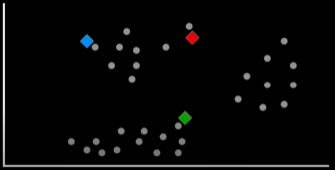 → 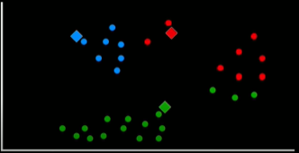

Since this clustering algorithm is an iterative process, the centers aren't fixed to where they are now. As we can see, the data in the red and greed clusters are not very close together. The next step in this process would be to move the cluster centers to the average of all the points in that cluster. Then, re-assign the points to the new clusters and continue this process until no points change in assignment. At this point, we can say that the data is reasonably well clustered.

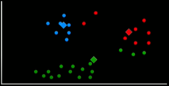 → 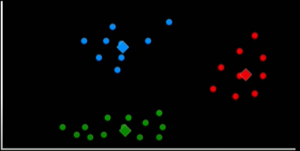