# Neural Networks - CS50AI Lecture 5

Biological neural networks are a system in the human body that consist of three stages: receptors, a neural network, and effectors. The receptors receive the stimuli either internally or from the external world, then pass the information into the neurons in a form of electrical impulses.

## Artificial Neural Networks:

- Mathematical model for learning inspired by biological neural networks that constitute animal brains. It works by mapping inputs to outputs based on the structure and parameters of the network.
- Allows for learning the network's parameters based on data.

To model this in our computer, we'll use an artificial neuron known as a unit. Units can connect in different ways to map outputs to inputs. The main goal of these units is to work together to solve a certain problem with a unique configuration of outputs to inputs.

## Neural Network Structure:

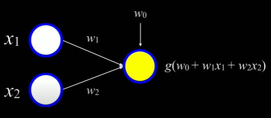

This is similar to the idea of hypothesis and classification functions. The units on the left can be thought of as the inputs and the unit on the right can be thought of as the output.

We can use a simple neural network to implement the **or** function, for example.  
- _x_0(bias): -1
- _x_1: 1 
- _x_2: 0
- Weights: 1
- Step Classification Function _g_

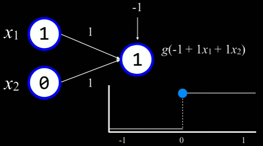

The input to _g_ can be simplified to _g_(-1 + 1(1) + 1(0)), or _g_(0) when we substitute the values of the weights. Then, _g_, or the step function evaluates the input value of 0 to the output value of 1(TRUE).

|x1|x2|g input|Output|
|--|--|-------|------|
|0 |0 |-1     |0     |
|1 |0 |0      |1     |
|0 |1 |0      |1     |
|1 |1 |1      |1     |

Similarly, if we wanted to implement a neural network to be able to function as **and**, we can change the bias to -2 instead of -1 so that 0 will only be reached if both _x_1 and _x_2 are 1. However, what if we wanted to have more than just 2 inputs? Neural Networks allow us to link together as many units as we want in any arrangement. For example, if we wanted 5 inputs to lead to 1 output, we could draw the structure and it would look something like this.

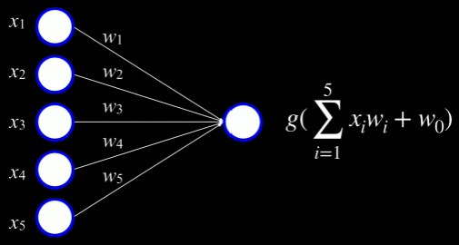

## Gradient Descent:

An algorithm for minimizing loss when training a neural networks.

- Start with a random choice of weights
- Repeat:
  - Calculate the gradient based on **all data points**: direction that will lead to decreasing loss
  - Update weights according to the gradient

One possible issue with the approach above is that for every update, we'll have to re-calculate the gradient based on **all data points** and that can be very expensive, or time consuming. With a similar algorithm called stochastic gradient descent, we'll ultimately be able to do this faster.

### Stochastic Gradient Descent:

- Start with a random choice of weights
- Repeat:
  - Calculate the gradient based on **one data point**: direction that will lead to decreasing loss
  - Update weights according to the gradient

Like always, this algorithm has its downsides. Although it is a lot less expensive in terms of time, the result will give us a less accurate result. So, we can look at another very similar algorithm called mini-batch.

### Mini-Batch Gradient Descent:

- Start with a random choice of weights
- Repeat:
  - Calculate the gradient based on **one small batch**: direction that will lead to decreasing loss
  - Update weights according to the gradient

This can be considered the middle ground in terms of gradient accuracy and time complexity.

## Multiple Outputs:

The above neural network structure is limited in the sense that there is only one unit as the output. This is useful when we are doing binary classifications like rain/no rain but what if we wanted to predict weather in the areas of rain, sun, clouds, and snow. To do this, we can introduce more units to the output and construct a neural network that looks like this:

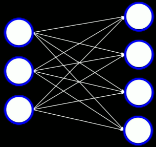

Now, there would be 4 different sets of weights used for each output. Now that we have looked at a simple neural network and discussed some variants, it's important to also discuss possible limitations of this approach. With perceptron, a linear combination of weights and inputs, we will only be able to do binary classification(classify data points given a data set that is **linearly separable**).

## Multilayer Neural Networks:

Artificial neural network with an input layer, an output layer, and at least one hidden layer.

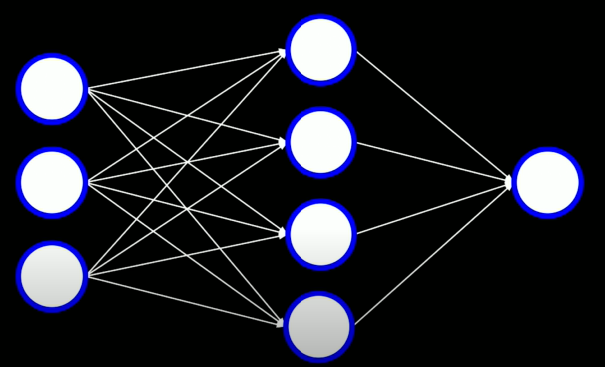

In this case, the hidden layer has 4 nodes/units but we will ultimately be able to choose how many we would like to have. As we can see, the inputs aren't directly linked to the outputs. They first link to the hidden layer, which intern, links to the output. Now, the hidden layer will calculate values based on the input and then the output will use the hidden layer's values to determine the result.

**Summary:** With this approach, each layer can learn different functions and we can combine them to classify data points that may or may not be linearly separable. Another important aspect for us to think about when considering multilayer neural networks is how to train the neural network. Since the input data doesn't tell us what the values for the hidden layers should be, we'll have to use another technique to estimate the hidden layer using loss.

## Backpropagation:

Algorithm for training neural networks with hidden layers.

- Start with a random choice of weights
- Repeat:
  - Calculate error for output layer.
  - For every layer, starting with output layer, and moving inwards towards earliest hidden layer:
    - Propagate error back one layer.
    - Update weights.

This is especially useful when the neural network in question is a deep neural network.

## Deep Neural Networks:

Neural Network with multiple hidden layers.

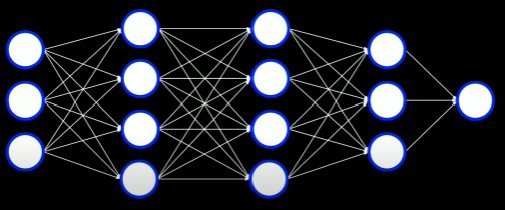

## Overfitting:

When a function is too closely fit to a limited set of data points([read more](https://github.com/itsmehere/CS50AI/blob/master/LectureNotes/Week4_Learning.md)).

### Dropout:

Temporarily removing units that are selected at random from a neural network to prevent over-reliance on certain units. For example, we might convert the deep neural network above to look more like this:

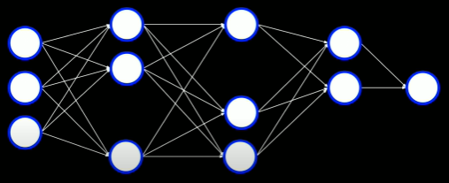

## TensorFlow:

A free and open-source software library developed by Google Brain([read more](https://www.tensorflow.org/)). 

### Playground:

Using the [tensor flow playground](http://playground.tensorflow.org), we can demonstrate some of the ideas discussed above.

Below, we can see a direct linkage from the input to the output and this works because the data is linearly separable.

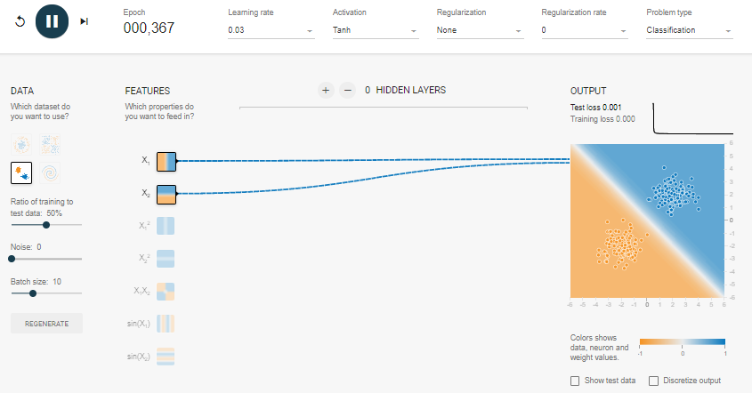

If we change the data set to one that is not as easily separable, we can't draw an accurate boundary.

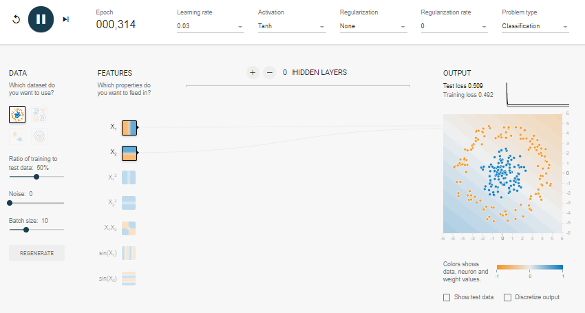

When we add a hidden layer, we see that although it is better than before, it is still not the type we would like.

We can introduce more hidden layers and/or more units in each hidden layer to create different combinations of activation functions. This will allow our network to learn how to separate data that isn't always going to be linearly distributed.

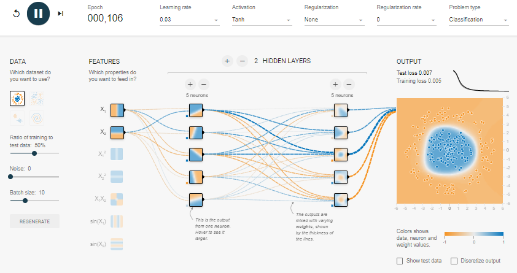

## Computer Vision:

Computational methods for analyzing and understanding digital images

If we wanted to train an AI to be able to identify different handwritten digits, it would be very unreliable to go through each pixel and check if it is equal to an example. Even if the handwritten digit is 1 pixel off, the AI would classify it differently. To make this more reliable, we can once again use neural networks. Imagine we had a digital image(where each pixel has a RGB value (0-255, 0-255, 0-255)) like this:

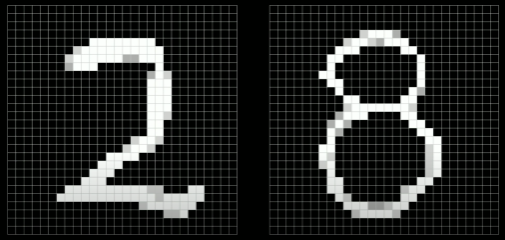

We can then construct a neural network that has as many inputs as pixels and using amount of hidden layers, train the network to classify the image. It could look something like this:

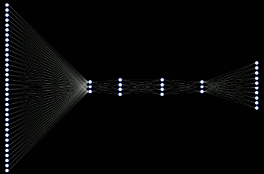

the drawbacks of this approach are that there will a lot of weights for us to calculate especially when the image is large. Perhaps the major drawback is that by flattening the pixels into a single input layer, we lose the image structure like curves, lines, and other features.

## Image Convolution:

Applying a filter that adds each pixel value of an image to its neighbors, weighted according to a kernel matrix.

Image Convolution Example:  
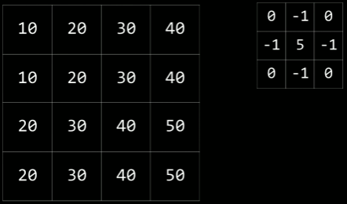

Using the kernel matrix in the top right, we can apply a filter to the image on the left. Since the kernel is a 3x3 grid, we can start by applying the filter to the top left 3x3 on the image. Since there are 4 3x3's on a 4x4 grid, we can create a 2x2 grid that will hold our filtered values:

|  |  |
|--|--|
|f1|f2|
|f3|f4|

To get the value of f1, we match each value in the 4x4, 3x3 grid, to the value in the kernel matrix. Then we multiply them together and add it to the result of doing the same for all other values in the matrix:

f1:  
10(0) + 20(-1) + 30(0) + 10(-1) + 20(5) + 30(-1) + 20(0) + 30(-1) + 40(0) = 10

f2:  
20(0) + 30(-1) + 40(0) + 20(-1) + 30(5) + 40(-1) + 30(0) + 40(-1) + 50(0) = 20

f3:  
10(0) + 20(-1) + 30(0) + 20(-1) + 30(5) + 40(-1) + 20(0) + 30(-1) + 40(0) = 40

f4:  
20(0) + 30(-1) + 40(0) + 30(-1) + 40(5) + 50(-1) + 30(0) + 40(-1) + 50(0) = 50

Here is the updated 2x2 grid:

|  |  |
|--|--|
|10|20|
|40|50|

### -1/8 Kernel Matrix:

Why might the above be useful? Let's take another example of a kernel matrix that looks like this:

|  |  |  |
|--|--|--|
|-1|-1|-1|
|-1|&nbsp;8|-1|
|-1|-1|-1|

And an image that looks like this:

|  |  |  |
|--|--|--|
|20|20|20|
|20|20|20|
|20|20|20|

When we apply the filter, the value we get is 0. What this tells us is that there isn't much variation in that section of the image. If we were to take another section where the middle value was higher, that would mean that there is variation.

## Pooling:

Reducing the size of an input by sampling from regions in the input.

## Max-Pooling:

Pooling by choosing maximum value in a particular region.

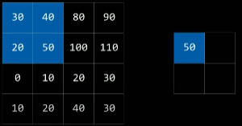 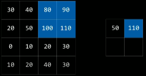  
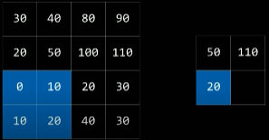 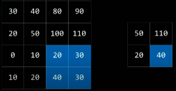

Now, we have a smaller representation of the original image and we can exclude specific pixels; meaning we don't care about which exact pixels are filled with what color.

## Convolutional Neural Networks:

Neural Networks that use convolution, usually for analyzing images.

- Start with image
- Use convolution to extract specific feature maps
  - Each map represents a unique characteristic i.e. curves, edges, shapes, etc...
  - Train neural networks to figure out values of kernel matrix
- Apply Pooling Algorithm to scale image down i.e. max-pooling, average pooling
- Flatten into the neural network as input 
  

We can improve this approach even more by performing convolution and pooling more than one time. This will allow us to shrink the input size to the network as well as identify different types of features. For example,

First Convolution & Pooling:
- Low-level features
  - edges
  - curves
  - shapes

Second Convolution & Pooling:
- High-level features
  - objects

Although we can have a bunch of layers and a bunch of units that try and classify images, convolutional networks and techniques come in quite handy in terms of optimization. On a higher level, when humans classify images, we don't look at every pixel to see if they're matching. Generally, we identify curves and then colors and maybe some other features depending on what we are trying to find. Convolution algorithms try to do the same thing.

## Feed-Forward Neural Network:

Neural Network that has connections only in one direction

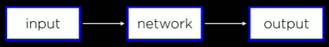

- Output is based purely on the input and calculation in the network. 
- Number of input & output is fixed. 
   
This is problematic when we want to describe a picture like, "A group of people walking in front of a building." We don't know the length of the text we want to output.

## Recurrent Neural Networks:

Neural Network that generates output that feeds back into its inputs

This allows the network to remember information that may be useful when dealing with sequences of data. Example: [Microsoft CaptionBot](https://www.captionbot.ai/) In the example above where we would like the output to be multiple words or a sentence describing the image, recurrent neural networks would come in handy because each output(a different word) is fed back into the same network to produce yet another output.

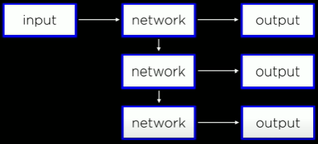

Another major application of recurrent neural networks is video processing. Videos are much harder to process than images because, in images, you can treat each pixel as a value but in videos, they're sequences of images/frames. Each time, the input is a new frame and when the next frame is processed, the network uses information from the previous network and previous input. In the last frame, we can output the final result.

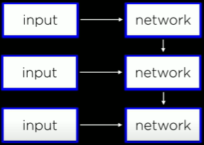